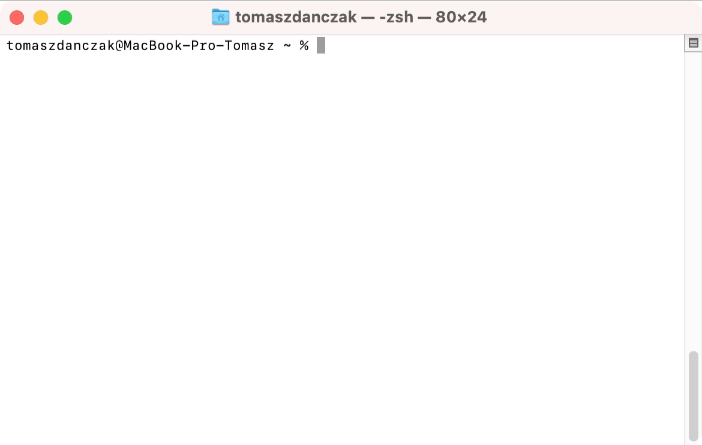
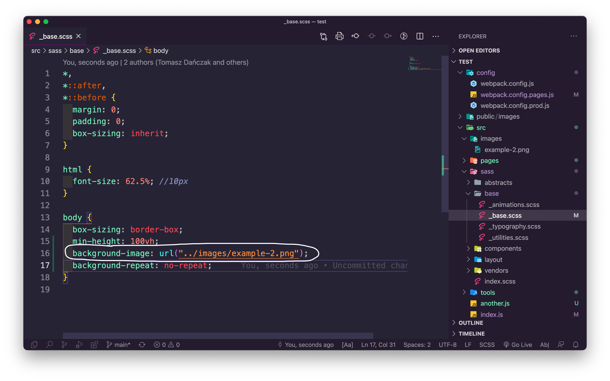
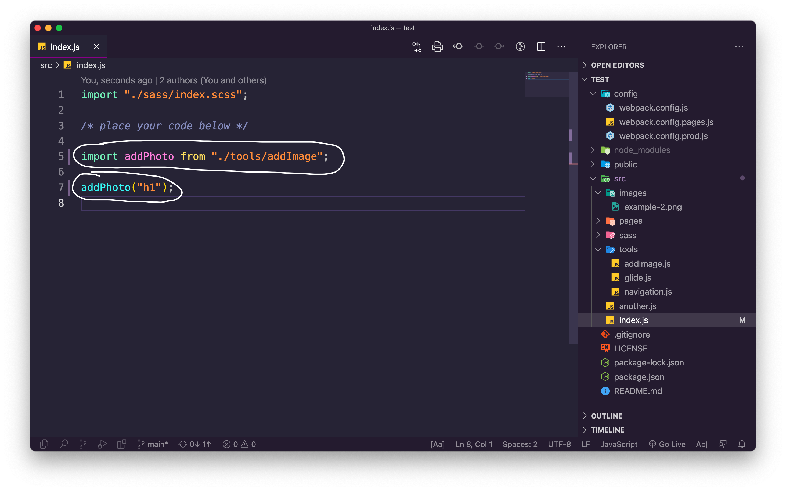

# Frontend StarterKit

Projekt jest gotową konfiguracją Webpacka. Dołączyłem do projektu także strukturę plików CSS według architektury 7-1 CSS Architecture.

[Webpack](https://webpack.js.org/) jest w tej chwili podstawowym narzędziem frontendowca. Jest tzw. “module bundlerem”. Zapewnia możliwość tworzenia projektu w sposób modułowy, za pomocą modułów CommonJS czy ES6 Modules. Webpack zajmie się przetłumaczeniem naszego kodu na kod zrozumiały przez przeglądarki. Zajmie się on także spakowaniem plików tak, żebyśmy wynikowo mieli tylko kilka plików statycznych, co z kolei pozwoli na szybsze ładowanie się stron.

Innym z aspektów działania Webpacka jest to, że podobnie jak task runnery umożliwia wykonywanie zautomatyzowanych działań na plikach. Pomaga on przy automatyzacji zadań takich jak:

- kompiluje pliki SASS na CSS,
- automatycznie przeładowuje strony w przeglądarce,
- mimifikuje czy uglifikuje pliki Javascript i CSS,
- i wiele innych.

Webpack jest bardzo pomocnym narzędziem przy budowaniu projektów, ale jego skonfigurowanie nie jest łatwe. Nie trzeba jednak samemu konfigurować Webpacka, żeby móc korzystać z tego co oferuje. Można wykorzystać gotowe konfiguracje takie jak ta. Jednak nawet wykorzystując gotowe konfiguracje także trzeba wiedzieć jak z nich korzystać, dlatego poniżej umieściłem opis jak pracować z tą konfiguracją.

[7-1 CSS Architecture](https://sass-guidelin.es/) jest to sposób układania struktury projektu wykorzystującego SCSS zaproponowany przez [Hugo “Kitty” Giraudel](https://hugogiraudel.com/). Architektura pomaga zapanować nad kodem CSS w projekcie.
Wraz ze zwiększaniem się rozmiaru projektu użycie 7-1 CSS Architecture daje coraz wieksze korzyści.

## 1. O projekcie

### Przygotowana konfiguracja Webpack zapewnia

- **Serwer deweloperski** - pozwala na budowanie aplikacji w czasie rzeczywistym, każda edycja kodu skutkuje odświeżeniem strony w przeglądarce.
- **Wsparcie dla SASS** - kompiluje SASS do CSS.
- **Sourcemap SASS i JavaScript** - tworzy mapy SASS i JavaScript
- **Obsługę grafik w plikach HTML, CSS oraz JavaScript** - zapewnia prawidłowe dodawanie grafik
- **Publikację projektu na GitHubie** - można opublikować projekt za pomocą jednej komendy (`npm run publish`).
- **Tworzenie wersji produkcyjnej** - utworzenie wersji do umieszczenia na serwerze.
- **Hashing** - zmienienie zawartości plików CSS lub JavaScript skutkuje wygenerowaniem plików wyjściowych z nowymi nazwami w celu zapewnienia prawidłowego ich pobierania przez przeglądarki. Jako, że mamy pliki ze zmieniającymi się nazwami Webpack musi zadbać o prawidłowe ich dołączenie do strony i to robi.
- **Generowanie plików HTML** - zyskujemy dzięki temu automatyczne generowanie plików HTML, z prawidłowym podpięciem do nich plików CSS. Możemy także wybierać jakie pliki JavaScript będą dołączane do jakich stron.
- **Plik webpack.config.pages.js** - wydzieliłem plik konfiguracyjny w którym należy przeprowadzić konfigurację nowych stron od reszty konfiguracji.

## 2. Tworzenie własnego projektu korzystającego ze Starterkita

Przed użyciem projektu wykorzystującego Webpack należy zainstalować [NODE.js](https://nodejs.org/en/) najlepiej w wersji LTS.

1. Na stronie z projektem należy kliknąć **Use this template** (trzeba być zalogowanym na swoim koncie na Githubie).


2. Następnie należy wpisać nazwę projektu i kliknąć **Create repository from template**.


## 3. Uruchomienie projektu

### 3.1 Należy skopiować link do utworzonego projektu

Po utworzeniu własnego projektu trzeba skopiować link do projektu (kliknąć **Code** a następnie skopiować link).


### 3.2 Pobranie projektu na dysk i uruchomienie

Należy uruchomić wiersz poleceń na Windows lub Terminal na Mac i przejść do lokalizacji, gdzie chcemy skopiować projekt.

- `ls` - wyświetlenie zawartości lokalizacji w której obecnie się znajdujemy
- `cd` - wejście do katalogu
- `cd ..` - wyjście katalog wyżej

Znajdując się w wybranej przez nas lokalizacji należy wpisać komendę `git clone` wraz z linkiem do projektu.

```
git clone link_do_projektu
```



### 3.3 Uruchomienie projektu

Po skopiowaniu projektu na dysk należy go uruchomić w edytorze kodu (np. w edytorze Visual Studio Code). Znajdując się w terminalu w lokalizacji z projektem należy wpisać komendę `code .`.


#### Projekt posiada konfigurację 4 trybów:

- start - uruchamia server deweloperski (tryb do pracy nad projektem)
- dev - buduje projekt w wersji developerskiej
- prod - buduje projekt, do umieszczenia na serwerze (tworzy katalog dist którego zawartość trzeba umieścić na serwerze)
- publish - publikuje projekt na GitHubie wykorzystując Github Pages

Po wybraniu trybu należy uruchomić terminal w edytorze (CTRL + backtick). A następnie wpisać komendę, na przykład:

```
npm run start
```

Powyższa komenda spowoduje uruchomienie serwera deweloperskiego. Dla komendy `npm run start` można użyć skróconej wersji `npm start`. Każda zmiana w projekcie zostanie odzwierciedlona na stronie w dowolnej przeglądarce internetowej po otworzeniu adresu [localhost:8080](http://localhost:8080/).  


## 4. Praca z projektem

### 4.1 Krótki przegląd plików

#### 4.1.1 Plik index.html

Plik index.html w którym powinien być umieszczony kod strony głównej znajduje się w katalogu page. Jest to tak naprawdę plik szablonowy, który będzie użyty do wygenerowania docelowego pliku index.html. Zostaną do niego automatycznie dołączone pliki CSS i JavaScript (nie dodajemy w tym pliku odwołań do plików CSS i JavaScript).


Do pliku będzie dołączony skrypt JavaScript utworzony na podstawie zależności znajdujących się w pliku index.js oraz plik ze stylami CSS utworzony na podstawie zależności z pliku index.scss.

#### 4.1.2 Przykładowa zawartość pliku index.js

Plik index.js jest plikiem wejściowym dla Webpacka. Na jego podstawie Webpack będzie budował jeden plik CSS oraz jeden plik Javascript.


Import pliku index.scss w linijce numer 1 jest dziwnie wyglądającym importem (importowany jest plik SCSS w pliku JavaScript). Taki import jest możliwy dzięki loaderowi dodanemu do konfiguracji. W tej linijce chodzi tak naprawdę o to, żeby dodać plik SCSS do drzewa zależności (obsłużeniem importu zajmie się konfiguracja Webpacka). Ta linijka jest konieczna do prawidłowego dołączenia styli CSS do projektu.
Plik index.scss zawiera w sobie importy plików cząstkowych SCSS (to ten plik trzeba edytować jeżeli chce się dodać pliki cząstkowe).

Import plików JavaSript jest standardowym importem plików JavaScript według ES6 Modules. W przykładzie przedstawionym na powyższym screenie do pliku index.js są importowane funkcje navigation (z pliku navigation.js) oraz glide (z pliku glide.js). Po zaimportowaniu funkcji są one wywoływane. Dzięki Webpackowi na podstawie plików navigation.js oraz glide.js zostanie utworzony jeden plik index.js, który będzie automatycznie dołączony do strony.

#### 4.1.4 Przykładowa zawartość pliku navigation.js

Używając importów plików JS należy pamiętać o ich wcześniejszym prawidłowym wyeksportowaniu. W poniższym przykładzie został użyty eksport domyślny, więc nie trzeba podawać nazwy eksportowanej funkcji. Przy eksporcie domyślnym, gdy importujemy funkcję możemy podać dowolną nazwę. Ciekawy artykuł o importach w plikach JS można znależć na blogu [kurs.js](https://kursjs.pl/kurs/es6/moduly.php)


#### 4.1.4 Przykładowa zawartość pliku index.scss

Plik index.scss jest zwykłym plikiem SCSS importującym pliki cząstkowe. Ciekawy artykuł o SASS można przeczytać na stronie [sass-guidelin.es/pl/](https://sass-guidelin.es/pl/).


### 4.2 Dodawanie podstron oraz umieszczenie w nich odwołań do plików JavaScript i CSS

W celu dodania podstron oraz automatycznego umieszczenia w nich odwołania do plików JavaScript oraz CSS należy dodać plik szablonowy HTML na podstawie którego będzie generowany plik wynikowy a następnie należy wyedytować plik konfiguracyjny webpack.config.pages.js w celu poinformowania Webpacka na podstawie jakiego pliku ma tworzyć podstronę.

#### 4.2.1 Dodanie pliku szablonowego HTML

Podstronę należy umieścić w katalogu pages (jak na poniższym screenie).


#### 4.2.2 Konfiguracja Webpacka dla nowych stron

Żeby ułatwić edycje konfiguracji Webpacka został wydzielony plik webpack.config.pages.js w którym znajduje się tylko konfiguracja odpowiedzialna za dodawanie stron do projektu oraz podpinanie do nich plików JavaScript i CSS. Pozostała konfiguracja Webpacka znajduje się w plikach webpack.config.js oraz webpack.config.prod.js.

> ❗️ Należy pamiętać, że po każdej edycji plików konfiguracyjnych należy zatrzymać Webpack (CTRL + C) i uruchomić go ponownie (npm start).


Dodanie konfiguracji nowych stron polega na stworzeniu instancję pluginu HtmlWebpackPlugin w pliku webpack.config.pages.js. Najprostszym sposobem jest skopiowanie istniejącej już instancji i następnie odpowiednie jej wyedytowanie.


- **title** - tutaj należy podać tytuł który ma być dodany do tagu title. W utworzonym pliku HTML można pominąć tag title. Jeżeli tag title będzie się znajdował i w konfiguracji Webpacka i w pliku HTML to górę bierze ten z pliku HTML.
- **template** - należy podać ścieżkę i nazwę pliku na podstawie, którego będzie generowany wynikowy plik HTML.
- **filename** - nazwa pliku wynikowego (dobrze jest ustawić na taką samą jak nazwa pliku na podstawie którego tworzymy podstronę).

Czyli podsumowując po skopiowaniu konfiguracji odpowiedzialnej za obsługę nowej strony najlepiej w zaznaczonych miejscach na poniższym screenie wpisać taką samą nazwę jak nazwa tworzonego pliku oraz w polu title wpisać nazwę strony.


#### 4.2.3 Utworzenie kilku plików JavaScript i użycie ich na różnych stronach

W pliku webpack.config.pages.js w entry możemy dodać kilka plików wejściowych wraz ze swoimi zależnościami na podstawie których zostaną utworzone wynikowe pliki wyjściowe.


Takie pliki można później dołączać do utworzonych stron wedle potrzeby (możemy dołączać skrypt tylko do tych stron, gdzie on rzeczywiście jest potrzebny).
Powyższa konfiguracja jeszcze nigdzie nie dołącza zależności powstałych na podstawie pliku another.js. Do stron powstałych na podstawie plików index.html oraz about.html będą dodane zależności utworzone od pliku index.js (domyślna praca Webpacka). Żeby wybierać jakie pliki mają być dołączane do jakich podstron należy użyć właściwości chunks i do niej przypisać tablicę zawierającą skrypty jakie mają być przypisane.


Powyższa konfiguracja utworzy dwie strony.
Stronę index.html na podstawie szablonowego pliku index.html, do którego dołączy pliki utworzone na podstawie zależności w pliku index.js oraz stronę about.html na podstawie szablonowego pliku about.html do ktrórego zostaną dołączone pliki na podstawie zależności w plikach index.js i another.js

### 4.3 Użycie grafik w projekcie

Używanie grafik w projekcie wymaga prawidłowego ich dołączania. Inaczej musimy postępować w przypadku użycia grafik w pliku HTML, inaczej w przypadku plików CSS i JS.

#### 4.3.1 Użycie grafik w pliku HTML

Żeby użyć grafiki w pliku HTML wystarczy umieścić ją w katalogu z zasobami statycznymi public, w podkatalogu images i odwoływać się do niej w pliku HTML w następujący sposób:

```html

```

Możemy także grafiki umieścić w katalogu src/images i budować ścieżki względne jak poniżej. W tym przypadku podajemy ścieżki względem plików źródłowych a nie serwerowych (możemy korzystać z podpowiedzi edytora):

```html

```

#### 4.3.2 Użycie grafik w pliku CSS

Grafiki, które będą używane w plikach CSS (np. w celu dodania właściwości w background-image) muszą być dostępne dla Webpacka już na etapie budowania projektu. Umieszczamy je w katalogu src, w podkatalogu images (nie w katalogu public/images jak w przypadku zasobów statycznych). Wewnątrz plików cząstkowych SASS odwołujemy się do takich grafik według poniższego schematu:

```css
background-image: url("../images/example-2.png");
```

> Trzeba mieć na uwadze to, że pliki cząstkowe są importowane w pliku index.scss dlatego budując ścieżkę względną wychodzimy raz a nie dwa razy do góry.



#### 4.3.3 Użycie grafik w pliku JS

Grafiki używane w plikach JavaScript tak samo jak grafiki dla CSS muszą być dostępne na etapie bundlingu (umieszczamy je także w katalogu src/images). Przed odwołaniem się do grafiki w pliku JavaScript należy ją zaimportować budując ścieżkę względem pliku JavaScript w którym jej używamy a samą grafiką - jak na poniższym screenie (wychodzimy jeden katalog do góry do katalogu src, a następnie wchodzimy w katalog img i wybieramy plik).

```js
import photo from "../images/example-2.png";
```


Żeby powyższy skrypt zadziałał trzeba pamiętać o dołączeniu pliku addImagee.js do zależności, np. w pliku index.js (patrz punkt: **4.2.3 Utworzenie kilku plików js i użycie ich na różnych stronach**).


cdn.
